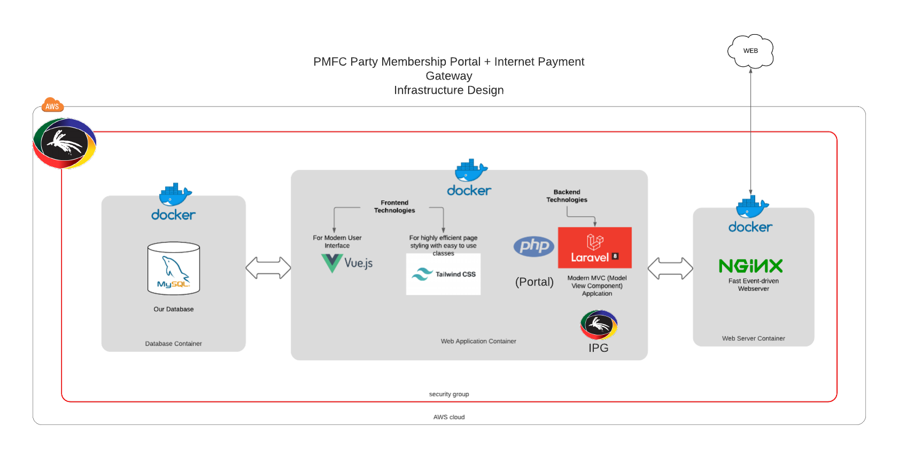

#  PMFCParty Portal&copy;
 

The PMFCParty Portal is a containerized end-to-end web application that servers two purposes:
- Membership Portal:
  - User login
  - Google Maps Geolocation
- Payment Gateway (API)
  - SPA Application with two (2) integrations:
    - Receive Donations via Membership Portal
    - Receive Donations via PMFCParty Website
## Important Note
This document exists to provide technical guidance to the developers of this application.

## Licence & Copyright
This software application remains the sole property of the &copy;[PMFCParty PNG](https://www.pmfcparty.com/home).
Any unauthorized duplication of this appqlication for personal, malicious or monetary intent is considered a crime, and punishable by law.

For more info, please email _Soxx_ or _SpiritEagle_ at ict@pmfcparty.com.
